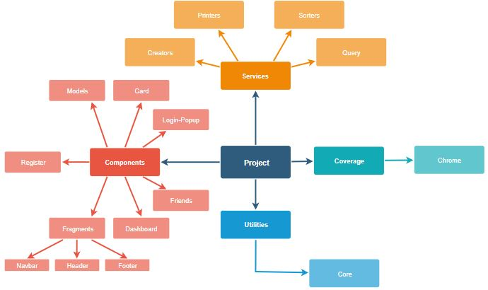

[[section-building-block-view]]

== Building Block View

****
Here is a simple scheme that explains the basic organizations of the application components:

****

=== Whitebox Overall System

We will explain some of the application parts functionality:

=== Components

****
This are the different components that interact between them. Each one component is divided in some files, but the most important ones are:

* HTML: Is represents the interface layer.
* JS: This is the logic layer, it must contain all the useful logic.
****

=== Services

****
Services are the utilities that our components use to help them improving it´s functionality.
****

=== Coverage
****
Represents the code testing. As we said before, tests are executed in Karma, with Jasmine framework. We use Google Chrome to execute the tests.
****

=== Utilities
****
It is all theuseful resources. In this case, weve used a core that allows us to interact with some librarys. It contains some useful methods.
****
