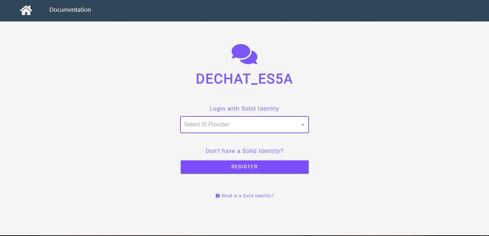
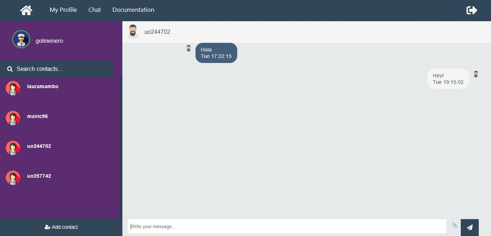
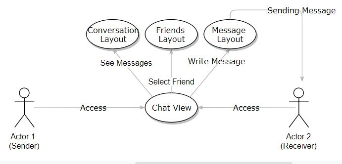
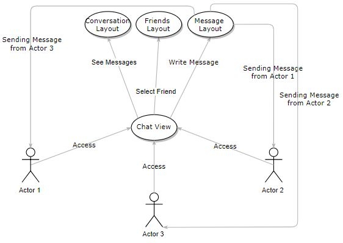

[[section-runtime-view]]
=== Runtime View

****
The architecture of the application is very simple:

Once you launch the applicacion, youll see a login views. That login view will redirect you to the official solid login page.

In the solid login page, you´ll introduce your solid credentials. If your data is correct, you´ll login into your profile and see your solid profile page.

In the navegation bar of the application, you will see 4 labels: 

* Profile: The same page. In there you can edit your profile information

* Chat: The chat page. We´ll introduce about it later.

* Documentation: A documentation page.

* A logout icon: It will redirect to the application login.

*The chat page*

As you can see, the chat page is divided in three layers:

* Friends layer: In this layer you can search between your friends (for those you should add in solid), and start a conversation.

* Conversation layer: Here it will show the different conversations. Your own messages will appear in white colour, and your friends´ will be black.

* Message layer: There you can send a message to your friend. Once you write you can press the button or simply the Enter key to send it. This message will appear as yours in the conversation layer and will be sended to your partner.

*Lets see a couple runtimes scenarios*

*Scenario 1*
Actor 1 wants to send a message to one of his friends, after login in successfully, his runtime would be like this:

*Scenario 2*
Actor 1 wants to send a message to Actor 2, Actor 2 sends a message to Actor 3 and Actor 3 sends a message to Actor 1:

