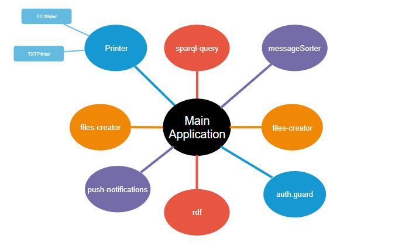

[[section-concepts]]
== Cross-cutting Concepts

[role="arc42help"]

=== Important modules
***
As we saw before, the architecture of the application is based on services, like printers, creators and another useful ones.

It is important to remember that for the application we are using npm, working (obviously) in Node.js, which is a package administrator that allows you to easily manage your resources.

* Testing *
To test our application, we are using karma testing, with the Jasmine framework.

Jasmine is an easy OpenSource framework that allows you to test JavaScript functionality developed in Angular.
More information here: 

https://en.wikipedia.org/wiki/Jasmine_(JavaScript_testing_framework)
****

=== Directory Structure and Required Files
This is the directory structure of the source folder:

----
├───app
│   ├───card
│   ├───chat
│   ├───dashboard
│   ├───fragments
│   │   ├───footer
│   │   ├───header
│   │   └───navbar
│   ├───friends
│   ├───login
│   ├───login-popup
│   ├───models
│   ├───register
│   └───services
│       ├───creators
│       ├───printers
│       ├───query
│       ├───sorters
│       └───utils
├───assets
│   ├───images
│   ├───js
│   │   └───libs
│   └───types
│       └───rdflib
├───coverage
│   └───Chrome 73.0.3683 (Windows 10 0.0.0)
└───environments
----

