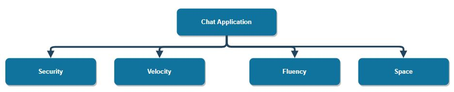

[[section-quality-scenarios]]
== Quality Requirements

[role="arc42help"]
****
There are some important quality requirements that need to be considered when developing an application, specially when you develop a server-connected one.

The most importants are:
 
* Velocity: When you are chatting with a friend, you need a fast application to make sure the conversation is fluid.
* Security: When talking about a de-centralized chat, we ensure that our application is well-safe and we have control of our own informations.
* Fluency: We need a optimized application.
* Space: This is a forgotten one. This kind of application should be light and easy to convert to an executable file.

****

=== Quality Tree

[role="arc42help"]
****
Heres a map that allows us to easily get a high quality application:

****

=== Quality Scenarios

[role="arc42help"]
****

****
*Scenario 1 - Security*

When a user tries to access to a private conversation, it should´t be permitted.

*Scenario 2 - Velocity and Fluency*

When conversating with a friend, it is really logic that conversation should be fast.

*Scenario 3 - Space* 

As we said, an application should be as lighter as possible, if a concrete use wants to create a portable version.
