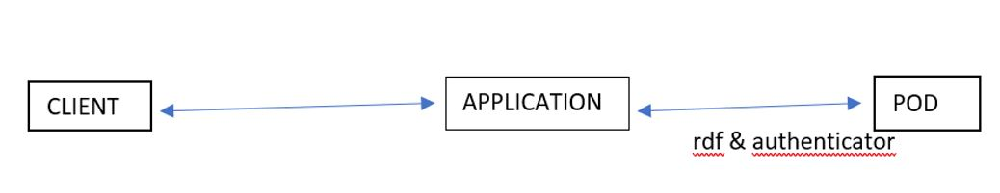
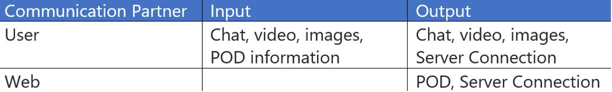
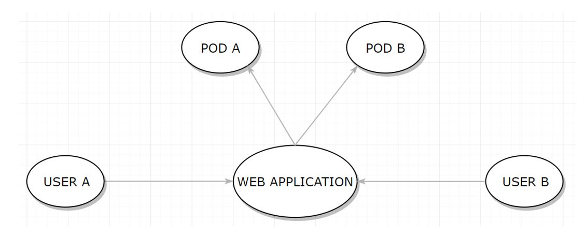

[[section-system-scope-and-context]]
== System Scope and Context

[role="arc42help"]
****
The project that we are going to develop aims to communicate two people through different mechanisms:

* *Text messages.*
* *Images.*
* *Videos.*
* *Video calls.*

However, the approach that the application will take it´s around permits. A user can not send a file of any kind or speak with a person if they do not have explicit permission from the recipient.

But the most important point of the chat is not the permissions, but the decentralization. We want only users to have access to the content of those conversations, so that they are the owners of their personal information.

To achieve this goal we will use SOLID.
SOLID is a project that consists of a decentralized website. It deals with establishing a connection between several users, separating data application. To establish this connection, we will use what is known as POD. A POD is a unique profile of each user, which allows to store information on the web about it.

We will use these PODs to connect both users, but the data they exchange will be stored in the interlocutors' devices.
In this way, we will create a private chat that will have the advantage of being isolated, reliable and safe.

****

=== Business Context

[role="arc42help"]
****
** Communication elements:

*  *Users:* Users are the main recipient of the application.
* *Web:* Users will connect to the web through their PODs to establish secure communication.

** Communication process:

* The partners create a POD.
* The user adds as friend through the PODs to the second interlocutor.
* The interlocutors log in with their POD in the chat.
* Ready!

What data are exchanged with the environment?
Through the website, users will enter some small data on the SOLID website to obtain their POD. Once established the connection between both interlocutors, they will be the only owners and holders of the information they exchange.

****

**<Diagram or Table>**

**<optionally: Explanation of external domain interfaces>**

=== Technical Context

[role="arc42help"]
****
As we have said before, we will use the so-called PODs provided by SOLID to connect to the server of the same, and through it, communicate with other people.

For the design of the connection we will use different mechanisms:

* *RDF:* This library allows us to establish the connection. Act as a communicator and thanks to it we can obtain the POD information necessary to establish communication.
* *Authenticator:* This tool receives the POD of a user and allows us to know if it is a valid POD.
* *Angular:* It is a JavaScript framework that will allow us to handle the language in a more comfortable way.

****
